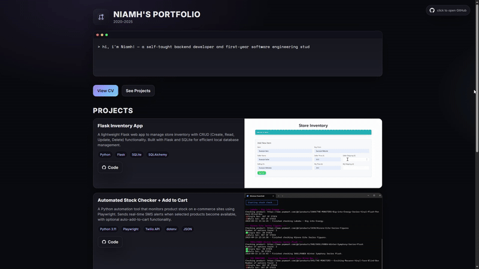

# Portfolio 2025

A modern, responsive portfolio website showcasing my work, skills, and
contact information. Built to highlight my projects in a clean and
professional way with simple navigation and a visually appealing layout.

[Visit Portfolio](https://niamhdev.com)

## 📸 Preview

[](https://niamhdev.com)

## 📁 File Structure 
```
root
│
├── index.html                 # Main portfolio page (structure + content)
│
└── assets/
    ├── css/
    │   └── style.css          # Global styling for the entire site
    │
    ├── js/
    │   ├── main.js          # bootstraps everything
    │   ├── projects.js      # card + modal rendering
    │   ├── media.js         # mp4/gif/png fallback logic
    │   └── intro.js         # typewriter effect
    │
    ├── data/
    │   └── projects.json      #Project data (titles, descriptions, stack, modal content)
    │   └── projects.template.json 
    │   └── about.json         #About me data 
    │
    ├── legacy/
    │   └── projects.legacy.js # Old Legacy Project data (titles, descriptions, stack, modal content)
    │
    │
    └── imgs/
        └── <project folders>  # Demo GIFs/PNGs for each project
```

## ✅ TODOS:

```
[ ] - Demos from the top load pirority 
[ ] - Archived and old projects seperate section
[ ] - Add wasd and arrow support for project scroll
[ ] - Clicking anywhere on project card opens modal  
```

## 📬 Contact

Feel free to get in touch using the contact form on the site. (Currently unavaliable, feel free to message me via github)